# Isaac Sim2Real 🤖

Real-time bidirectional control bridge between NVIDIA Isaac Sim 5.1 and Dynamixel servo motors with **intelligent obstacle avoidance**. Learn in simulation, transfer to hardware - enabling seamless sim-to-real transfer for robotics research and development.

[](https://opensource.org/licenses/MIT)
[](https://www.python.org/downloads/)
[](https://developer.nvidia.com/isaac-sim)

## 📑 Table of Contents

- [✨ Features](#-features)
- [📊 System Architecture](#-system-architecture)
  - [High-Level System Overview](#high-level-system-overview)
  - [Obstacle Avoidance State Machine](#obstacle-avoidance-state-machine)
  - [Intelligent Decision Making Flow](#intelligent-decision-making-flow)
  - [Data Flow: Simulation to Hardware](#data-flow-simulation-to-hardware)
  - [Component Interaction Map](#component-interaction-map)
  - [Hardware Connection Diagram](#hardware-connection-diagram)
- [📋 Prerequisites](#-prerequisites)
- [🚀 Quick Start](#-quick-start)
- [📂 Project Structure](#-project-structure)
- [🔧 Configuration](#-configuration)
- [🧹 Maintenance & Cleanup](#-maintenance--cleanup)
- [🧪 Testing Components](#-testing-components)
- [📚 Documentation](#-documentation)
- [🐛 Troubleshooting](#-troubleshooting)
- [🤝 Contributing](#-contributing)
- [📄 License](#-license)

## ✨ Features

### Core Capabilities
- 🎮 **Real-time Control**: Keyboard-driven control with <100ms latency
- 🧭 **Autonomous Navigation**: Point-and-go waypoint navigation with path planning
- 🔄 **Bi-directional Sync**: Sim → Hardware and Hardware → Sim feedback loops
- 🚗 **Multi-Robot Support**: Control 2+ robots simultaneously (Jetbot with differential drive)
- 🛡️ **Safe Operation**: Emergency stop, velocity limiting, error handling

### Intelligent Obstacle Avoidance 🚦
- **Smart Detection**: PhysX raycast-based forward sensing (60° FOV, 8m range, ~10 rays)
- **Intelligent Behaviors**: 
  - Gradual slowdown as obstacles approach (proactive safety zone)
  - Smart turn direction selection (analyzes left/right clearance)
  - Smooth acceleration/deceleration transitions
  - Hysteresis-based state transitions (prevent oscillation)
- **Dual-Robot Avoidance**: Robots detect and avoid each other automatically
- **5-State Machine**: FORWARD, STOP, REVERSE, TURN, EMERGENCY_STOP
- **Tunable Parameters**: obstacle threshold (0.8m), clear margin (0.5m), reverse duration (1.8s)

### Development Features
- 🧪 **Modular Testing**: Test hardware and simulation independently
- 📊 **Live Monitoring**: Real-time status display with emojis (⚠️ ⚙️ 🔄 ↻ ✓)
- 🐍 **Clean Python**: Type hints, docstrings, PEP 8 compliant
- 🔧 **Hardware Utilities**: Motor ID scanner, tester, and configuration tools

## � System Architecture

### High-Level System Overview


### Obstacle Avoidance State Machine

```mermaid
stateDiagram-v2
    [*] --> FORWARD: System Start
    
    FORWARD --> FORWARD: No obstacle detected<br/>Distance > 1.2m
    FORWARD --> FORWARD: Gradual slowdown<br/>0.8m < Distance < 1.2m
    FORWARD --> STOP: Obstacle detected<br/>Distance < 0.8m
    
    STOP --> REVERSE: After 0.3s assessment<br/>Choose turn direction
    
    REVERSE --> TURN: After 1.8s<br/>Completed reverse
    
    TURN --> TURN: Path blocked<br/>Continue turning
    TURN --> FORWARD: Path clear<br/>Distance > 1.3m
    
    FORWARD --> EMERGENCY_STOP: User presses 'E'
    STOP --> EMERGENCY_STOP: User presses 'E'
    REVERSE --> EMERGENCY_STOP: User presses 'E'
    TURN --> EMERGENCY_STOP: User presses 'E'
    
    EMERGENCY_STOP --> FORWARD: User presses 'E' again<br/>Reset system
    
    note right of FORWARD
        🚀 Normal operation
        Velocity: 0.5 m/s
        Proactive slowdown
    end note
    
    note right of STOP
        ⚠️ Assessment pause
        Duration: 0.3s
        Analyze clearance
    end note
    
    note right of REVERSE
        🔄 Evasive maneuver
        Velocity: -0.15 m/s
        Duration: 1.8s
        Smooth ramp-up
    end note
    
    note right of TURN
        ↻ Smart rotation
        Speed: π/4 rad/s
        Direction: Toward clear side
        Exit: Distance > 1.3m
    end note
    
    note right of EMERGENCY_STOP
        🛑 All systems halt
        Toggle with 'E' key
        Affects both robots
    end note
```



### Intelligent Decision Making Flow

```mermaid
flowchart TD
    A[Read Raycast Data<br/>~10 rays across 60°] --> B{All rays valid?}
    
    B -->|No| C[Mark sensor not ready<br/>Return FORWARD at 0 velocity]
    B -->|Yes| D[Find minimum distance<br/>across all rays]
    
    D --> E[Analyze left clearance<br/>rays 0-4]
    D --> F[Analyze right clearance<br/>rays 5-9]
    
    E --> G[Compare left vs right<br/>clearance distances]
    F --> G
    
    G --> H{Which side clearer?}
    H -->|Left| I[Set turn direction: LEFT<br/>preferred_turn_direction = +1]
    H -->|Right| J[Set turn direction: RIGHT<br/>preferred_turn_direction = -1]
    
    I --> K{Current State?}
    J --> K
    
    K -->|FORWARD| L{Distance check}
    L -->|< 0.8m| M[Transition to STOP<br/>Print obstacle warning]
    L -->|0.8-1.2m| N[Gradual slowdown<br/>30%-100% speed<br/>Print caution message]
    L -->|> 1.2m| O[Full speed ahead<br/>Return None]
    
    K -->|STOP| P{Elapsed > 0.3s?}
    P -->|Yes| Q[Transition to REVERSE<br/>Print maneuver start]
    P -->|No| R[Hold position<br/>Return 0,0]
    
    K -->|REVERSE| S{Elapsed > 1.8s?}
    S -->|Yes| T[Transition to TURN<br/>Print turning message]
    S -->|No| U[Continue reverse<br/>Ramp velocity over 0.5s]
    
    K -->|TURN| V{Distance > 1.3m<br/>OR timeout > 4s?}
    V -->|Yes| W[Transition to FORWARD<br/>Print path clear]
    V -->|No| X[Keep turning<br/>Use smart direction]
    
    K -->|EMERGENCY_STOP| Y[Return 0,0<br/>All motion halted]
    
    style A fill:#e1f5ff
    style M fill:#ffe1e1
    style N fill:#fff4e1
    style O fill:#e1ffe1
    style H fill:#ffe1ff
    style Y fill:#ffcccc
```



### Data Flow: Simulation to Hardware


### Component Interaction Map


### Hardware Connection Diagram

```mermaid
graph TD
    subgraph "Computer"
        A[Ubuntu 24.04<br/>NVIDIA GPU]
        B[Isaac Sim 5.1<br/>Python Environment]
        C[Python Script<br/>wearhaus_room_jetbot_avoidance.py]
    end
    
    subgraph "USB Connection"
        D[/dev/ttyUSB0<br/>Serial Port<br/>57600 baud]
    end
    
    subgraph "Dynamixel Network"
        E[U2D2 USB Adapter<br/>TTL to Serial]
        F[Daisy Chain<br/>3-pin TTL Bus]
    end
    
    subgraph "Robot 1 Hardware"
        G[Motor ID 1<br/>Left Wheel<br/>XL430-W250-T]
        H[Motor ID 2<br/>Right Wheel<br/>XL430-W250-T]
    end
    
    subgraph "Robot 2 Hardware"
        I[Motor ID 3<br/>Left Wheel<br/>XL430-W250-T]
        J[Motor ID 4<br/>Right Wheel<br/>XL430-W250-T]
    end
    
    subgraph "Power Supply"
        K[12V SMPS<br/>2A minimum]
    end
    
    A --> B
    B --> C
    C <--> D
    D <--> E
    
    E <--> F
    
    F <--> G
    F <--> H
    F <--> I
    F <--> J
    
    K -.->|12V Power| G
    K -.->|12V Power| H
    K -.->|12V Power| I
    K -.->|12V Power| J
    
    style A fill:#e1f5ff
    style C fill:#fff4e1
    style E fill:#e1ffe1
    style K fill:#ffe1e1
```

## �📋 Prerequisites

### Hardware

**Jetbot Configuration:**
- 2-4× Dynamixel XL430-W250-T servo motors per robot ([e-Manual](https://emanual.robotis.com/docs/en/dxl/x/xl430-w250/))
  - Robot 1: Motor IDs 1 (Left) & 2 (Right)
  - Robot 2: Motor IDs 3 (Left) & 4 (Right)
- 1× U2D2 USB communication adapter
- 12V power supply (SMPS recommended)

**Computer:**
- Computer with NVIDIA GPU (Compute Capability ≥ 5.0)
- Ubuntu 20.04+ (tested on 24.04 LTS)
- NVIDIA Isaac Sim 5.1 installed

### Software
- Python 3.11+
- CUDA 12.0+ with compatible drivers
- Isaac Sim 5.1 (with Python environment)

## 🚀 Quick Start

### 1. Clone and Setup Virtual Environment

```bash
cd ~/Desktop
git clone <repository-url> isaac-sim2real
cd isaac-sim2real

# Create and activate virtual environment
python3 -m venv .venv
source .venv/bin/activate

# Install Python dependencies
pip install --upgrade pip
pip install -r requirements.txt
```

### 2. Configure Hardware

```bash
# Grant serial port permissions
sudo usermod -aG dialout $USER
newgrp dialout  # or logout/login

# Verify motors are detected
python tools/hardware/dxl_idscan.py

# Expected output:
# [Dynamixel] Scanning motors on /dev/ttyUSB0 @ 57600 baud...
#   Motor ID 1 detected
#   Motor ID 2 detected
#   Motor ID 3 detected
#   Motor ID 4 detected
```

### 3. Install Isaac Sim Dependencies

```bash
cd ~/Desktop/isaacsim/_build/linux-x86_64/release
./python.sh -m pip install --upgrade pip
./python.sh -m pip install dynamixel-sdk pynput
```

### 4. Verify Setup

```bash
cd ~/Desktop/isaacsim/_build/linux-x86_64/release
./python.sh ~/Desktop/isaac-sim2real/scripts/verify_setup.py
```

### 5. Run Examples 🎯

#### Option A: Dual-Robot Obstacle Avoidance (Recommended)

**⚠️ CRITICAL: Must use Isaac Sim's Python interpreter!**

```bash
# Method 1: Direct execution
cd ~/Desktop/isaacsim/_build/linux-x86_64/release
./python.sh ~/Desktop/isaac-sim2real/examples/wearhaus_room_jetbot_avoidance.py

# Method 2: Use the menu script (easier)
cd ~/Desktop/isaac-sim2real/scripts
./run_isaac_dxl.sh  # Choose option 9
```

**Features:**
- 2 Jetbots with differential drive
- Intelligent obstacle avoidance
- Hardware control (Motor IDs 1-4)
- Wearhaus-style warehouse environment
- Real-time feedback display

**Controls:**
- `E` : Toggle emergency stop (both robots)
- `Ctrl+C` : Quit application
- Robots move forward autonomously and avoid obstacles

#### Option B: Manual Control Bridge

```bash
cd ~/Desktop/isaacsim/_build/linux-x86_64/release
./python.sh ~/Desktop/isaac-sim2real/src/isaac_dxl_bridge.py

# Or use menu:
cd ~/Desktop/isaac-sim2real/scripts
./run_isaac_dxl.sh  # Choose option 5
```

**Keyboard Controls:**

**Mode Toggle:**
- `N` : Toggle between Keyboard and Navigation modes

**Keyboard Mode (Manual Control):**
- `↑` / `↓` : Forward / Backward
- `←` / `→` : Turn Left / Right (Skid Steering)
- `1-9` : Speed Control (10%-90%)
- `SPACE` : Emergency Stop

**Navigation Mode (Autonomous):**
- `W` : Navigate forward 2 meters
- `A` : Navigate left 2 meters
- `S` : Navigate backward 2 meters
- `D` : Navigate right 2 meters

**Common:**
- `ESC` : Quit Application

**❌ DO NOT run with regular Python:**
```bash
# These will fail with "ModuleNotFoundError: No module named 'isaacsim'"
python examples/wearhaus_room_jetbot_avoidance.py
source .venv/bin/activate && python examples/wearhaus_room_jetbot_avoidance.py
```

> **Why?** The `isaacsim` module is only available in Isaac Sim's Python environment.
> See [HOW_TO_RUN.md](HOW_TO_RUN.md) for detailed explanation.

## 📂 Project Structure

```
isaac-sim2real/
├── examples/                     # Isaac Sim example scripts
│   ├── wearhaus_room_jetbot_avoidance.py  # ⭐ Dual-robot obstacle avoidance (main demo)
│   ├── wearhaus_room_jetbot.py            # Single jetbot with manual control
│   ├── sample_room_robot.py               # Sample room with NVIDIA robot
│   ├── minimal_jetbot.py                  # Minimal jetbot example
│   └── README.md                          # Examples documentation
├── src/                          # Main source code
│   ├── isaac_dxl_bridge.py      # Full Isaac Sim ↔ Hardware bridge (manual control)
│   └── simple_gui_test.py       # Hardware-only GUI test
├── scripts/                      # Utility scripts
│   ├── run_isaac_dxl.sh         # 🚀 Main launcher script (menu-driven)
│   ├── verify_setup.py          # Setup verification
│   └── cleanup.sh               # Workspace cleanup script
├── tests/                        # Unit & integration tests
│   ├── test_isaac_only.py       # Isaac Sim integration test
│   ├── test_bridge_components.py # Component unit tests
│   └── test_lidar_avoidance.py  # Obstacle avoidance tests
├── tools/                        # Development tools
│   └── hardware/                # Hardware diagnostic utilities
│       ├── dxl_idscan.py        # Motor ID scanner (scan all motors on bus)
│       ├── dxl_change_id.py     # Motor ID changer (reassign motor IDs)
│       ├── motor_test_single.py # Single motor test (verify individual motor)
│       └── README.md            # Hardware tools documentation
├── assets/                       # Robot models and resources
│   └── ROBOT.usd                # Custom robot USD file
├── config/                       # Configuration files
│   └── config.example.py        # Example configuration
├── docs/                         # Documentation
│   ├── HARDWARE_SETUP.md        # Hardware setup guide
│   ├── TROUBLESHOOTING.md       # Common issues & solutions
│   └── archive/                 # Archived/historical documentation
├── requirements.txt             # Python dependencies
├── HOW_TO_RUN.md                # ⚠️ Python interpreter guide (READ THIS FIRST!)
├── SERVO_CONTROL_GUIDE.md       # Complete servo control documentation
├── SAMPLE_ROOM_SETUP.md         # Sample room environment guide
├── WEARHAUS_ROOM_GUIDE.md       # Wearhaus environment guide
├── QUICK_START.txt              # Quick reference card
├── LICENSE                      # MIT License
├── CONTRIBUTING.md              # Contribution guidelines
└── README.md                    # This file
```

## 🔧 Configuration

Copy and customize the example config:

```bash
cp config/config.example.py config/config.py
# Edit config/config.py with your hardware settings
```

Key configuration options:
- `DEVICE_PORT`: Serial port (default: `/dev/ttyUSB0`)
- `MOTOR_IDS`: Motor ID mapping [Robot1_L, Robot1_R, Robot2_L, Robot2_R]
- `VELOCITY_LIMIT`: Maximum motor velocity
- `UPDATE_RATE_HZ`: Control loop frequency

### Obstacle Avoidance Configuration

See `examples/wearhaus_room_jetbot_avoidance.py` for tunable parameters:

```python
AVOIDANCE_CONFIG = {
    "obstacle_threshold": 0.8,      # Stop distance (meters)
    "clear_margin": 0.5,            # Hysteresis margin (meters)
    "reverse_speed": 0.15,          # Reverse velocity (m/s)
    "reverse_duration": 1.8,        # Reverse time (seconds)
    "turn_speed": math.pi / 4,      # Turn angular velocity (rad/s)
    "turn_angle": math.pi / 2,      # Turn amount (radians, ~90°)
    "lidar_fov": 60.0,              # Forward arc coverage (degrees)
    # ... see file for all 13 parameters
}
```

## 🧹 Maintenance & Cleanup

### Quick Cleanup

Use the automated cleanup script:

```bash
cd ~/Desktop/isaac-sim2real
./scripts/cleanup.sh
```

This interactive script will:
- Clean Python cache files (__pycache__, .pyc, .pytest_cache)
- Optionally recreate Python virtual environment
- Remove temporary files

### Manual Cleanup

**Recreate Python Environment:**
```bash
cd ~/Desktop/isaac-sim2real
rm -rf .venv
python3 -m venv .venv
source .venv/bin/activate
pip install --upgrade pip
pip install -r requirements.txt
```

**Clean Python Cache:**
```bash
find . -type d -name "__pycache__" -not -path "./.venv/*" -exec rm -rf {} + 2>/dev/null
find . -type f -name "*.pyc" -not -path "./.venv/*" -delete 2>/dev/null
find . -type d -name ".pytest_cache" -not -path "./.venv/*" -exec rm -rf {} + 2>/dev/null
```

## 🧪 Testing Components

Test each component independently before running the full system:

```bash
# 1. Dual-robot obstacle avoidance demo (⭐ main feature)
cd ~/Desktop/isaacsim/_build/linux-x86_64/release
./python.sh ~/Desktop/isaac-sim2real/examples/wearhaus_room_jetbot_avoidance.py

# 2. Sample room with NVIDIA robot (no hardware needed)
./python.sh ~/Desktop/isaac-sim2real/examples/sample_room_robot.py

# 3. Test hardware only (no Isaac Sim) - Use virtual environment Python
cd ~/Desktop/isaac-sim2real
source .venv/bin/activate
python src/simple_gui_test.py

# 4. Test Isaac Sim only (no hardware) - Use Isaac Sim Python
cd ~/Desktop/isaacsim/_build/linux-x86_64/release
./python.sh ~/Desktop/isaac-sim2real/tests/test_isaac_only.py

# 5. Run unit tests - Use virtual environment Python
cd ~/Desktop/isaac-sim2real
source .venv/bin/activate
pytest tests/ -v
```

**Important:** 
- Scripts that import `isaacsim` **must** use Isaac Sim's `python.sh`
- Scripts that only test hardware can use the virtual environment
- See [HOW_TO_RUN.md](HOW_TO_RUN.md) for details
- See [SERVO_CONTROL_GUIDE.md](SERVO_CONTROL_GUIDE.md) for servo integration

## 📚 Documentation

- **[HOW_TO_RUN.md](HOW_TO_RUN.md)** - ⚠️ Critical: Python interpreter guide (read first!)
- **[Hardware Setup Guide](docs/HARDWARE_SETUP.md)** - Detailed hardware assembly and wiring
- **[Troubleshooting](docs/TROUBLESHOOTING.md)** - Common issues and solutions
- **[Servo Control Guide](SERVO_CONTROL_GUIDE.md)** - Complete Dynamixel integration
- **[Wearhaus Room Guide](WEARHAUS_ROOM_GUIDE.md)** - Warehouse environment setup
- **[Sample Room Guide](SAMPLE_ROOM_SETUP.md)** - Basic environment setup
- **[Contributing](CONTRIBUTING.md)** - How to contribute to this project

## 🐛 Troubleshooting

### Common Issues

**Permission denied on /dev/ttyUSB0**
```bash
sudo usermod -aG dialout $USER
newgrp dialout
```

**Motors not responding**
- Verify power supply is connected (12V)
- Check motor IDs: `python tools/hardware/dxl_idscan.py`
- Ensure baudrate matches (default: 57600)
- Test individual motors: `python tools/hardware/motor_test_single.py`

**Isaac Sim import errors**
```bash
cd ~/Desktop/isaacsim/_build/linux-x86_64/release
./python.sh -m pip install dynamixel-sdk pynput
```

**Robot not visible in viewport**
- Press `F` to frame camera on robot
- Check terminal for USD loading errors
- Verify environment loaded correctly

**Obstacle avoidance not working**
- Check LiDAR initialization messages (should see 20-step warm-up)
- Verify raycast fallback is active (check debug messages)
- Ensure test obstacle has PhysX collision enabled
- Monitor console for distance readings

**Both robots not moving**
- Verify all 4 motors initialized (should see IDs 1,2,3,4 ready)
- Check hardware connections for all motors
- Monitor console for per-robot motor feedback

See [TROUBLESHOOTING.md](docs/TROUBLESHOOTING.md) for more solutions.

## 🤝 Contributing

Contributions are welcome! Please read [CONTRIBUTING.md](CONTRIBUTING.md) before submitting PRs.

### Development Setup

```bash
# Install development dependencies
pip install -r requirements.txt
pip install black pytest pytest-cov

# Format code
black src/ tests/ examples/

# Run tests
pytest tests/ -v --cov=src
```

## 📄 License

This project is licensed under the MIT License - see [LICENSE](LICENSE) file for details.

## 🙏 Acknowledgments

- NVIDIA Isaac Sim team for the simulation platform
- ROBOTIS for Dynamixel SDK and hardware
- Contributors and testers

## 💬 Support

- **Issues**: [GitHub Issues](https://github.com/GEMIT-Institute-of-HS-Niederrhein/isaac-sim2real/issues)
- **Documentation**: See `docs/` directory
- **Hardware**: 
  - [XL430-W250-T e-Manual](https://emanual.robotis.com/docs/en/dxl/x/xl430-w250/)
  - [Dynamixel SDK](https://emanual.robotis.com/docs/en/software/dynamixel/dynamixel_sdk/overview/)
- **Isaac Sim**: [Official Documentation](https://docs.omniverse.nvidia.com/isaacsim/latest/)

---

**Note**: This is a development prototype. Always test in a safe environment with emergency stop procedures in place.
