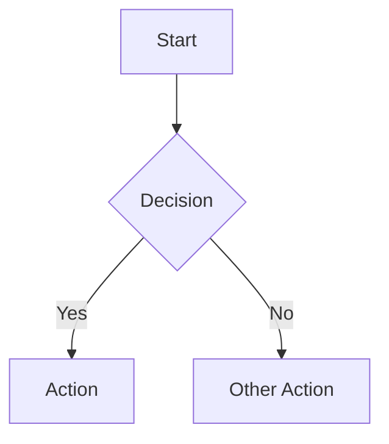
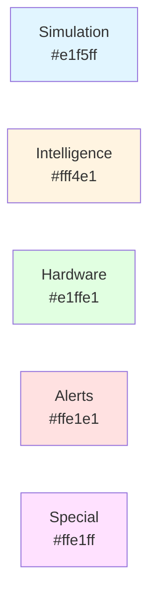

# Visual Documentation Guide

This document explains the diagrams added to the main README for better project understanding.

## 📊 Diagrams Overview

The README now includes **6 comprehensive Mermaid diagrams** that render directly on GitHub:

### 1. 🏗️ High-Level System Overview
**Purpose:** Shows the complete architecture from Isaac Sim to hardware motors

**What it shows:**
- Isaac Sim environment with 2 Jetbots and warehouse
- PhysX raycast sensors for each robot
- Avoidance controllers processing sensor data
- Differential controllers for wheel kinematics
- DynamixelController managing 4 motors
- Bidirectional data flow (sim ↔ hardware)

**Key Insights:**
- See how robots spawn at different positions (-0.3/-0.5 vs 0.3/-0.6)
- Understand sensor → controller → motor pipeline
- Visualize feedback loops from hardware back to console

### 2. 🤖 Obstacle Avoidance State Machine
**Purpose:** Explains the 5-state intelligent behavior system

**What it shows:**
- All 5 states: FORWARD, STOP, REVERSE, TURN, EMERGENCY_STOP
- Transitions between states with conditions
- Timing parameters (0.3s stop, 1.8s reverse)
- Emergency stop behavior (toggleable with 'E' key)

**Key Insights:**
- See the complete decision flow from detection to avoidance
- Understand why robots pause, reverse, then turn
- Learn how hysteresis prevents oscillation (0.8m trigger, 1.3m clear)

**Notes on each state:**
- **FORWARD**: Gradual slowdown from 1.2m → 0.8m
- **STOP**: 0.3s assessment pause to choose direction
- **REVERSE**: 1.8s with smooth ramp-up (0.5s acceleration)
- **TURN**: Smart direction based on left/right clearance analysis
- **EMERGENCY_STOP**: Affects both robots, toggleable

### 3. 🧠 Intelligent Decision Making Flow
**Purpose:** Shows the step-by-step logic for smart avoidance

**What it shows:**
- Raycast data processing (~10 rays)
- Left/right clearance analysis (rays 0-4 vs 5-9)
- Turn direction selection (prefer clearer side)
- State-specific behaviors with conditions
- Distance thresholds and velocity scaling

**Key Insights:**
- Understand how robots "think" about obstacles
- See the math behind gradual slowdown (30%-100% speed)
- Learn why robots choose left vs right turns

**Decision Points:**
- Distance < 0.8m → STOP
- Distance 0.8-1.2m → Gradual slowdown
- Distance > 1.2m → Full speed
- Left clearer → Turn left (+1)
- Right clearer → Turn right (-1)

### 4. 🔄 Data Flow: Simulation to Hardware
**Purpose:** Sequence diagram showing real-time data flow at 100Hz

**What it shows:**
- Exact order of operations each simulation step
- Communication between all components
- Parallel processing for Robot 1 and Robot 2
- Timing: Complete cycle in <100ms

**Key Insights:**
- See how 100Hz control loop works
- Understand where latency might occur
- Visualize bidirectional sync (sim → hardware → feedback)

**Flow Breakdown:**
1. Physics engine updates (Isaac Sim)
2. Raycasts query scene (PhysX)
3. Avoidance logic computes commands
4. Differential controller converts to wheel velocities
5. Dynamixel SDK sends to motors
6. Motors execute and report back
7. Console displays status

### 5. 🔌 Component Interaction Map
**Purpose:** Shows how all software components connect

**What it shows:**
- 6 distinct layers: UI, Simulation, Sensing, Intelligence, Control, Hardware
- Data flow between components
- Feedback loops
- User input integration

**Key Insights:**
- See the complete software architecture
- Understand separation of concerns
- Identify where to add new features

**Layers:**
- **User Interface**: Keyboard input ('E' for emergency stop)
- **Simulation**: World, Robots, Environment
- **Sensing**: PhysX raycasts (2 independent sensors)
- **Intelligence**: Avoidance controllers + smart decision engine
- **Control**: Differential controllers (kinematics)
- **Hardware**: Dynamixel SDK → U2D2 → Motors

### 6. 🔧 Hardware Connection Diagram
**Purpose:** Physical wiring and connection topology

**What it shows:**
- Computer → USB → U2D2 adapter
- Daisy-chain TTL bus connecting 4 motors
- Power supply connections
- Motor ID assignments

**Key Insights:**
- Understand physical setup requirements
- See why motors share a single USB port
- Learn the daisy-chain topology

**Connections:**
- Computer: Ubuntu 24.04 with NVIDIA GPU
- Serial: /dev/ttyUSB0 @ 57600 baud
- Bus: 3-pin TTL (Data, GND, VCC)
- Power: 12V SMPS, 2A minimum
- Motors: IDs 1,2,3,4 on same bus

## 🎨 Diagram Rendering

### On GitHub
All diagrams are written in **Mermaid** syntax and render automatically on GitHub:
- No external tools needed
- Always up-to-date
- Interactive (can zoom/pan)
- Professional appearance

### Locally
To preview locally:

**Option 1: VS Code Extension**
```bash
# Install Mermaid Preview extension
code --install-extension bierner.markdown-mermaid
```

**Option 2: GitHub Desktop**
- View in GitHub Desktop's markdown preview
- Automatically renders Mermaid diagrams

**Option 3: Web Browser**
```bash
# Push to GitHub and view in browser
git push origin main
# View README.md on GitHub
```

## 📝 Updating Diagrams

### Mermaid Syntax
All diagrams use Mermaid markdown syntax:

```markdown

```

### Common Diagram Types Used

1. **Flowchart** (`graph TD`): System overview, component interaction
2. **State Diagram** (`stateDiagram-v2`): State machine
3. **Flowchart** (`flowchart TD`): Decision making flow
4. **Sequence Diagram** (`sequenceDiagram`): Data flow

### Editing Tips

1. **Test Locally First**: Use VS Code with Mermaid extension
2. **Keep it Simple**: Don't overcrowd diagrams
3. **Use Colors**: `style A fill:#color` for emphasis
4. **Add Notes**: `note right of A` for explanations
5. **Maintain Consistency**: Use same color scheme across diagrams

### Color Scheme Used



- **Light Blue** (#e1f5ff): Simulation/Software
- **Light Yellow** (#fff4e1): Intelligence/Decision-making
- **Light Green** (#e1ffe1): Hardware/Control
- **Light Red** (#ffe1e1): Alerts/Important
- **Light Purple** (#ffe1ff): Special/Branching

## 🔗 Related Documentation

- **Main README**: Complete project overview with all diagrams
- **CHANGELOG.md**: Documents when diagrams were added
- **examples/README.md**: Example-specific flowcharts
- **TROUBLESHOOTING.md**: Debugging flowcharts (future)

## 📚 Learn More About Mermaid

- **Official Docs**: https://mermaid.js.org/
- **Live Editor**: https://mermaid.live/
- **GitHub Support**: https://github.blog/2022-02-14-include-diagrams-markdown-files-mermaid/

## 🎯 Benefits of Visual Documentation

### For New Users
- **Faster Onboarding**: Understand system in minutes, not hours
- **Clear Architecture**: See how components fit together
- **Decision Transparency**: Understand why robots behave as they do

### For Developers
- **Debugging Aid**: Trace data flow through diagrams
- **Feature Planning**: Identify where new features fit
- **Communication Tool**: Share understanding with team

### For Contributors
- **Contribution Clarity**: Know where to add code
- **Impact Analysis**: See what your changes affect
- **Review Assistance**: Explain PRs with diagram references

## ✅ Diagram Checklist

When updating diagrams:

- [ ] Diagram renders correctly on GitHub
- [ ] All components labeled clearly
- [ ] Colors used consistently
- [ ] Notes explain complex parts
- [ ] Matches actual implementation
- [ ] Cross-referenced in documentation
- [ ] Version controlled (in README)
- [ ] Accessibility considered (color-blind friendly)

## 🚀 Future Diagram Ideas

Potential additions:

1. **Timing Diagram**: Show 100Hz control loop timing
2. **Network Topology**: For multi-computer setups
3. **Error Flow**: How errors propagate and are handled
4. **Test Architecture**: Test suite organization
5. **Deployment Diagram**: Installation and setup flow
6. **Class Diagram**: OOP structure (Python classes)

---

**Created:** November 9, 2025  
**Purpose:** Documentation of visual aids in main README  
**Diagrams:** 6 Mermaid diagrams rendering on GitHub  
**Maintenance:** Update when architecture changes
